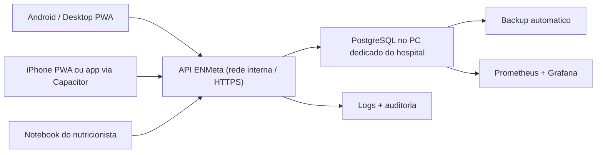

# PWA hospitalar, sincronizacao e operacao 24h

## Recomendacao objetiva

Para o ENMeta no hospital, a melhor estrategia inicial e:

1. usar o app como `PWA`
2. manter `backend API + PostgreSQL` no PC dedicado da unidade
3. fazer cada aparelho conversar com a API, nunca com o banco diretamente
4. evoluir a gravacao para um modelo `offline-first com fila de sincronizacao`

Esse desenho reduz custo operacional, evita manter tres apps separados e aproveita a base React atual.

## Arquitetura recomendada

## Por que PWA primeiro

- a base atual ja e web e usa `vite-plugin-pwa`
- instalacao simples em Android e desktop
- atualizacao centralizada sem loja
- menor custo de manutencao
- mesma experiencia para navegador, tablet e celular

## Onde o PWA ja esta hoje

- manifesto PWA em `vite.config.ts`
- install prompt inicial no frontend
- status de conectividade no topo da interface
- verificacao recorrente da API da unidade antes de considerar o app sincronizado

## Como cada aparelho deve funcionar

### Modo online

1. o usuario cria ou edita um dado no aparelho
2. o app envia para a API da unidade
3. a API valida, grava no PostgreSQL e responde
4. o app so marca como salvo depois da confirmacao da API

### Modo offline ou rede instavel

1. o usuario continua preenchendo no aparelho
2. o app salva localmente em `IndexedDB`
3. a operacao entra numa `fila de sincronizacao`
4. quando a rede voltar, a fila reenvia os itens para a API
5. a API grava no banco e confirma cada item
6. o app remove da fila apenas o que foi confirmado

## Regra importante

`falha zero` nao existe. O que da para fazer e deixar o fluxo resiliente e auditavel.

## O que eu recomendo implementar na camada de sincronizacao

### 1. Fila local de escrita

Usar `IndexedDB` com uma tabela de operacoes pendentes contendo:

- `id`
- `entityType`
- `entityId`
- `operation` (`create`, `update`, `delete`)
- `payload`
- `createdAt`
- `attemptCount`
- `lastError`
- `idempotencyKey`

### 2. Idempotencia no backend

Cada envio de escrita deve carregar uma `idempotencyKey`.

Se o aparelho reenviar por timeout ou retry, a API reconhece a chave e evita duplicar o registro.

### 3. Retry com backoff

- primeira tentativa imediata
- retries com espera crescente
- limite maximo de tentativas antes de marcar como erro manual

### 4. Estado visivel ao usuario

O app deve mostrar claramente:

- `Sincronizado`
- `Offline`
- `Servidor indisponivel`
- `Itens pendentes`
- `Erro de sincronizacao`

### 5. Auditoria

Toda alteracao critica deve guardar:

- usuario
- data/hora
- aparelho ou origem
- operacao
- status final

## Como tratar conflito

Conflito vai acontecer quando dois aparelhos mexerem no mesmo registro.

Minha recomendacao:

- para cadastros mestres, usar `ultima atualizacao vence`, mas gravando historico
- para prescricoes e cancelamentos, exigir controle mais rigido
- em prescricoes ativas, preferir bloquear com versao do registro

### Estrategia sugerida para prescricoes

- cada prescricao leva `version`
- o app envia a `version` atual ao salvar
- se a API detectar que a versao mudou no servidor, responde conflito
- o usuario decide revisar antes de sobrescrever

## Recomendacao para iPhone e Android

### Android

`PWA` deve atender bem na primeira fase.

### iPhone

PWA funciona, mas com mais limitacoes do Safari.

Se o uso em iPhone virar prioridade operacional forte, a recomendacao e empacotar a mesma base com `Capacitor`.

## Operacao 24h no hospital

No PC dedicado:

- `PostgreSQL`
- `backend API`
- `Prometheus`
- `Grafana`
- backup automatico
- `UPS/no-break`

## Monitoramento minimo

- saude da API
- disponibilidade do PostgreSQL
- uso de CPU, RAM e disco
- espaco em disco dos backups
- conexoes ativas
- queries lentas
- falhas de sincronizacao

## Instalacao nos aparelhos

### Android

1. abrir a URL interna do ENMeta
2. tocar em `Instalar app`
3. conceder permissao de notificacoes se voces forem usar isso depois

### iPhone

1. abrir no Safari
2. tocar em compartilhar
3. escolher `Adicionar a Tela de Inicio`

## Fases recomendadas

### Fase 1

- PWA instalado
- PostgreSQL central
- API central
- monitoramento basico
- status de conectividade no app

### Fase 2

- fila offline em `IndexedDB`
- retry automatico
- idempotencia
- indicadores de itens pendentes

### Fase 3

- resolucao de conflito
- telemetria de sincronizacao
- empacotamento com `Capacitor` se iOS exigir mais robustez

## O que ainda falta para ficar hospitalar de ponta

- fila real de sincronizacao offline-first
- idempotencia no backend para escritas
- bloqueio/conflito por versao em prescricoes
- telemetria de sincronizacao por aparelho
- politica de sessao mobile e renovacao de token
